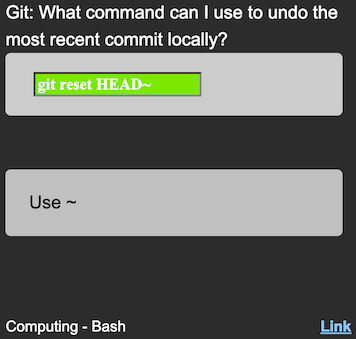
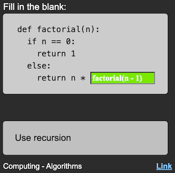
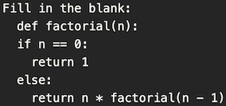
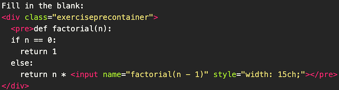
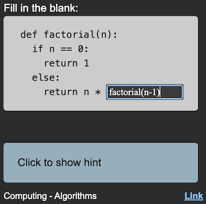

#  Code Cards for Anki

Unlock faster, more engaging code practice on the go with **Code Cards for Anki**—a sleek, friction‑free template that turns your flashcards into interactive coding exercises. Perfect for students, bootcampers, and devs who want to level up their skills anywhere, anytime.




## 🚀 Why You’ll Love It

- **Instant Focus**: Automatically jump into the first input field—no extra clicks or taps needed.
- **Error‑Proof Typing**: Quotes normalize, whitespace trims, and autocorrect/spellcheck disable for flawless code input, even on mobile.
- **Visual Feedback**: Correct answers glow green, incorrect ones glow red—so you know exactly where you went right or wrong.
- **Zero Setup Headache**: Simply add the templates, set your fields, and start crafting custom code challenges in minutes.

## 🔑 Key Features

1. **Autofocus First Input**\
   Launch straight into your code snippet as soon as the card appears—streamlining your workflow.

2. **Smart Quote & Whitespace Handling**\
   Automatic conversion of curly quotes to straight, plus whitespace stripping, keeps your answers accurate and consistent.

3. **Autocorrect & Spellcheck Off**\
   Code typing never gets in your way—no more rogue suggestions or red underlines.

4. **Dynamic Grading**\
   After flipping, each input field highlights: green for correct, red for incorrect, without shifting your layout.

5. **Seamless Tag & URL Integration**\
   Organize by hierarchical tags (`content::Lang::Topic`, `src::Source`) and auto‑link your first `src` tag to an external URL.

## 📝 Example
Before inserting a code block:



After inserting a code block:



How it looks like:



When checking your answer:


## 🔧 Quick Setup

1. **Add the Note Type**

   - In Anki: `Tools → Manage Note Types → Add → Add: Basic`
   - Name it something like `Code Card`

2. **Define Fields**

   1. Front
   2. Back
   3. Hint
   4. URL

3. **Install Templates**

   - Open your new note type, click **Cards**, and paste:
     - **Front template**: `code_cards/front_template.html`
     - **Back template**: `code_cards/back_template.html`
     - **Styling**: `code_cards/styling.css`

4. **Customize to Your Taste**\
   Tweak CSS or HTML snippets to match your personal coding style and workflow.

## 📚 Crafting Interactive Code Cards

1. **Open HTML Editor** (`Ctrl+Shift+X`) in Anki.
2. **Insert a Code Block** with inputs. Example:
   ```html
   Git: What command can I use to undo the most recent commit locally?
   <div class="exerciseprecontainer">
     <pre>
       <input name="git reset HEAD~" style="width: 20ch;">
     </pre>
   </div>
   ```
3. **Adjust Sizes** by changing `style` attribute.
4. **Repeat** for each input, keeping lines tidy.

> **Pro tip:** Use the **Hint** field to add a help box on the front and auto‑reveal on the back. Leave blank to skip it entirely.

## 🏷️ Tagging

- Follow `content::C1::C2 src::S1::S2` for hierarchical organization
- Tags are sorted and displayed in alphabetical order

## 🔗 Linking

If you fill in the `URL` field, then the first `src` tag will be replaced with a hyperlink to that url

**Key point** - make sure to copy the URL as raw text (by doing `Ctrl+Shift+v`). If you don't, then it will show up as blue in the Anki editor, and it won't work. One way to check this is to press `Ctrl+Shift+x` to open the HTML editor, and check that the URL only appears as raw text there

If you don't fill in this field, then there will be no hyperlink, but the tags will still work fine

## ⚙️ Development

- **Build JS:** `npx tsc -p tsconfig.json` → outputs to `dist/`.
- **Run Tests:**
  ```bash
  npm install && npm test
  ```

Contributions, issues, and feedback welcome! 🛠️\
Star ⭐ if this repo saved you coding time.

**Elevate your Anki workflow—turn passive review into active coding practice.**

