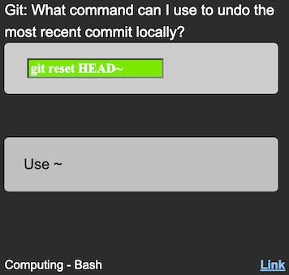
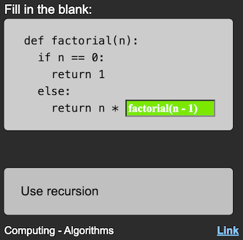
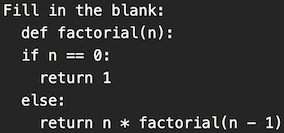
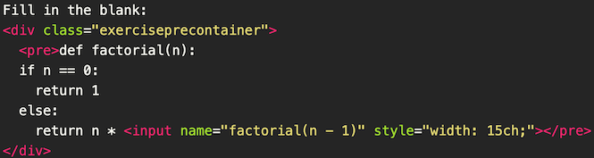
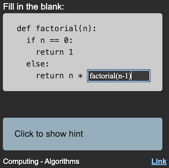

#  Code Cards for Anki

[](https://github.com/muhsinali/anki_templates/actions/workflows/ci.yml)

Unlock faster, more engaging code practice on the go with **Code Cards for Anki**—a sleek, friction‑free template that turns your flashcards into interactive coding exercises. Perfect for students, bootcampers, and devs who want to level up their skills anywhere, anytime.




## 🚀 Why You’ll Love It

- **Instant Focus**: Automatically jump into the first input field—no extra clicks or taps needed.
- **Error‑Proof Typing**: Quotes normalize, whitespace trims, and autocorrect/spellcheck disable for flawless code input, even on mobile.
- **Clear Feedback**: Correct and incorrect answers get distinct styling, text labels, and screen-reader labels; wrong answers also show what you typed.
- **Zero Setup Headache**: Simply add the templates, set your fields, and start crafting custom code challenges in minutes.

## 🔑 Key Features

1. **Autofocus First Input**\
   Launch straight into your code snippet as soon as the card appears—streamlining your workflow.

2. **Smart Quote & Whitespace Handling**\
   Automatic conversion of curly quotes to straight, plus whitespace stripping, keeps your answers accurate and consistent.

3. **Autocorrect & Spellcheck Off**\
   Code typing never gets in your way—no more rogue suggestions or red underlines.

4. **Dynamic Grading**\
   After flipping, each input field is marked correct or incorrect, locked read-only, and paired with visible feedback.

5. **Seamless Tag & URL Integration**\
   Organize by hierarchical tags (`content::Lang::Topic`, `src::Source`) and add a compact source link from the URL field.

## 📝 Example
Before inserting a code block:



After inserting a code block:



How it looks like:



When checking your answer:


## 🔧 Quick Setup

1. **Add the Note Type**

   - In Anki: `Tools → Manage Note Types → Add → Add: Basic`
   - Name it something like `Code Card`

2. **Define Fields**

   1. Front
   2. Back
   3. Hint
   4. URL

3. **Install Templates**

   - Open your new note type, click **Cards**, and paste:
     - **Front template**: `code_cards/front_template.html`
     - **Back template**: `code_cards/back_template.html`
     - **Styling**: `code_cards/styling.css`

4. **Customize to Your Taste**\
   Tweak CSS or HTML snippets to match your personal coding style and workflow.

## 📚 Crafting Interactive Code Cards

1. **Open HTML Editor** (`Ctrl+Shift+X`) in Anki.
2. **Insert a Code Block** with inputs. Example:
   ```html
   Git: What command can I use to undo the most recent commit locally?
   <div class="exerciseprecontainer">
     <pre>
       <input name="git reset HEAD~" style="width: 20ch;">
     </pre>
   </div>
   ```
3. **Adjust Sizes** by changing `style` attribute.
4. **Repeat** for each input, keeping lines tidy.

> **Pro tip:** Use the **Hint** field to add a help box on the front and auto‑reveal on the back. Leave blank to skip it entirely.

## 🏷️ Tagging

- Follow `content::C1::C2 src::S1::S2` for hierarchical organization
- Tags are sorted and displayed in alphabetical order

## 🔗 Linking

Fill in the `URL` field with a raw `http://` or `https://` URL, or with a link from Anki's editor. The template displays it as a compact `Link` in the bottom-right corner.

If the field is empty or does not look like an HTTP(S) URL, no link is shown and the tags still work normally.

## ⚙️ Development

Requires Node.js 26.4.0 or newer. `.nvmrc` and CI pin 26.4.0 as the tested baseline.

```bash
npm install     # Install dependencies
npm run build   # Regenerate code_cards/*.html from src/ + templates/
npm test        # Run the Jest test suite
```

Prefer `make`? Run `make` on its own to list the available shortcuts — `make check`
(tests + build) is the one to run before committing.

- **[BUILD.md](BUILD.md)** — full build, test, and troubleshooting guide
- **[Architecture diagrams](documentation/architecture-diagrams/README.md)** — Mermaid diagrams of the build pipeline and runtime data flow

Contributions, issues, and feedback welcome! 🛠️\
Star ⭐ if this repo saved you coding time.

**Elevate your Anki workflow—turn passive review into active coding practice.**
