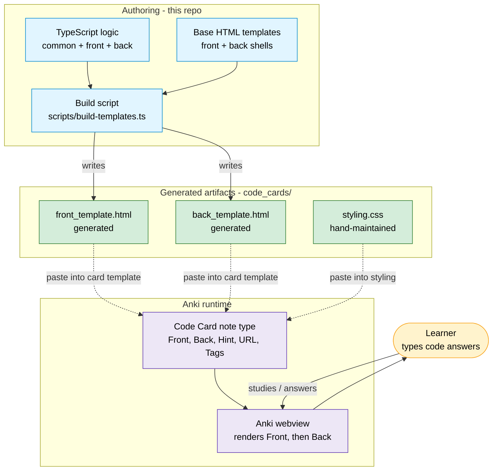

# 1 · System Context

The big picture: how a change flows from the TypeScript/HTML sources in this
repo, through the build step, and into a running Anki flashcard that a learner
studies.

There are **three worlds**:

1. **Authoring** — the source of truth that lives in this repository.
2. **Generated artifacts** — the `code_cards/` files a human copies into Anki.
3. **Anki (runtime)** — where the generated HTML actually executes, inside
   Anki's embedded webview.

## Key facts

- **The repo produces HTML, not a running app.** The deliverables are three
  text files that a user manually pastes into Anki's card editor.
- **`styling.css` is a manual boundary.** It lives in `code_cards/` alongside
  the generated HTML but is **not** produced by the build — it is edited by hand.
  Its first line `@import url("_editor_button_styles.css")` references a file in
  the user's **Anki media collection**, not in this repo; if absent, the import
  fails silently.
- **Anki is the runtime.** The transpiled JavaScript only ever runs inside
  Anki's webview (or jsdom during tests), never in this repo directly.
- **Five Anki fields drive a card:** `Front`, `Back`, `Hint`, `URL`, and the
  built-in `Tags`. See [`04-runtime-data-flow`](./04-runtime-data-flow.md) for
  how these are consumed at runtime.
