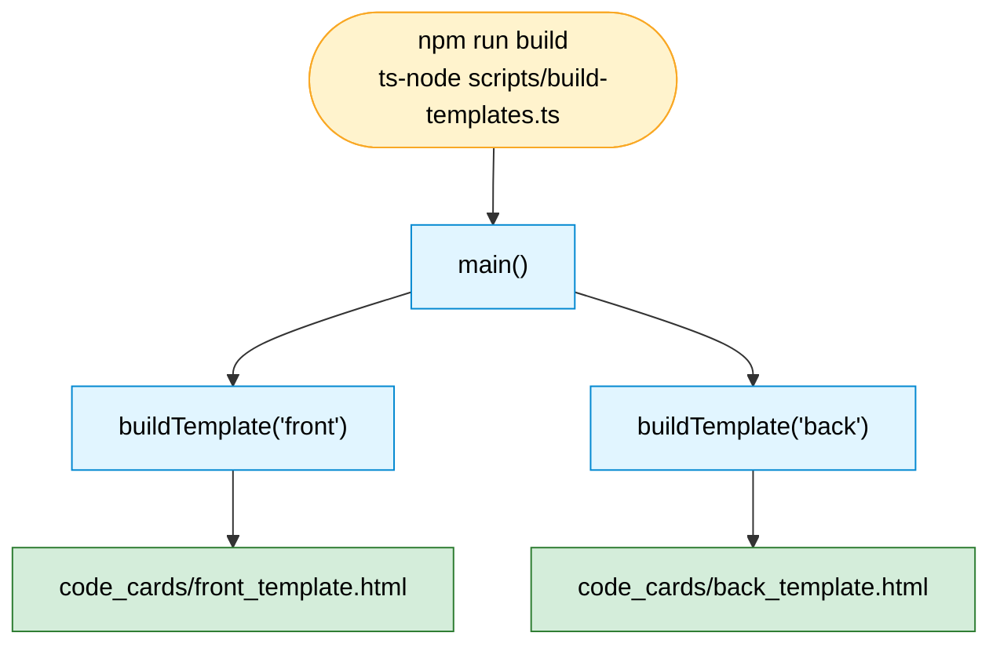
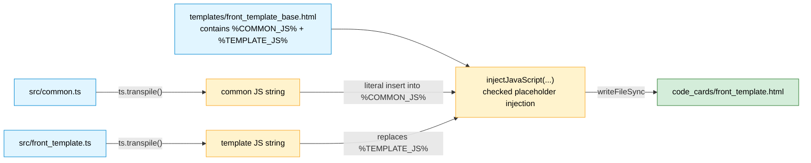

# 2 · Build Pipeline

How `npm run build` turns TypeScript + base HTML into the two Anki-ready HTML
files. Implemented in [`scripts/build-templates.ts`](../../scripts/build-templates.ts).

## Orchestration

`main()` calls `buildTemplate()` twice — once for each card side. The same
function body runs with `name = "front"` and then `name = "back"`.

## Inside `buildTemplate(name)` — the transpile + inject step

For each side, three inputs are combined: the base HTML shell plus two blobs of
transpiled JavaScript. The base HTML contains two placeholder tokens that are
validated and replaced with literal JavaScript text. The diagram shows the
`front` side; `back` is identical with `back_*` filenames.

## Why it works this way

- **`module: none`, `target: ES2022`** — `transpileTypeScript()` passes these to
  `ts.transpile()`. `module: none` means there is **no module wrapper**: every
  top-level `function` becomes a plain global. That is what lets the front card
  write `window.data` and the back card read it (see
  [`04-runtime-data-flow`](./04-runtime-data-flow.md)). Anki's webview does not
  support ES modules.
- **Two placeholders, one order.** The base HTML always lays out
  `%COMMON_JS%` before `%TEMPLATE_JS%`, so common functions
  (`displayTags`, `prettifyTag`, `setLinkText`) are defined before the
  template-specific code that calls them. The build now fails clearly if either
  placeholder is missing.
- **Literal JavaScript injection.** `injectJavaScript()` uses replacer callbacks
  so JavaScript strings containing replacement patterns like `$$` or `$&` are
  copied byte-for-byte into the generated template.
- **Purely synchronous & string-based.** The build is `readFileSync` →
  `ts.transpile` → checked placeholder injection → `writeFileSync`. No bundler,
  no DOM, no source maps.
- **`styling.css` is never touched by this pipeline** — it is maintained by hand
  in `code_cards/`.

## Related

- Module/file relationships: [`03-module-structure`](./03-module-structure.md)
- What the transpiled functions do at runtime:
  [`06-card-lifecycles`](./06-card-lifecycles.md)
