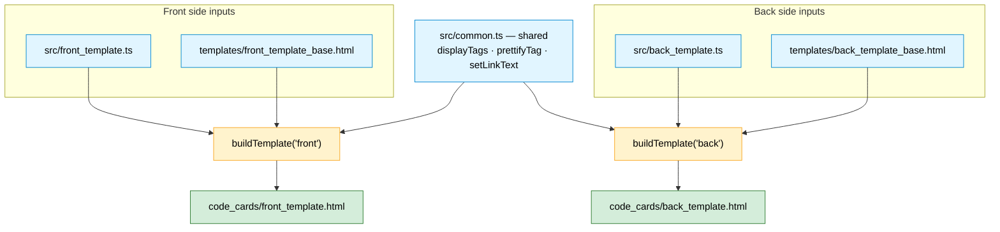
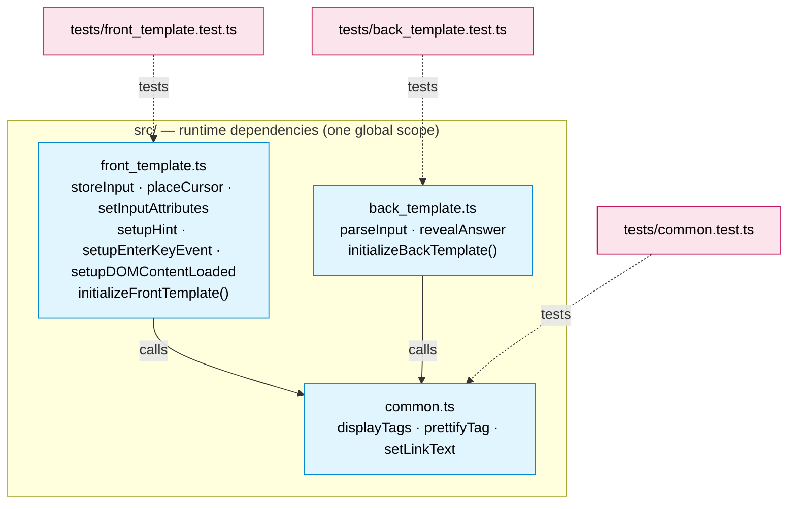

# 3 · Module & File Structure

The file layout has two independent stories, so this page keeps them as two
small diagrams instead of one crowded graph:

- **3a — Build-time composition:** which source files combine into each
  generated card.
- **3b — Code relationships:** how the `src/` files depend on each other at
  runtime, and how the tests map onto them.

## 3a · Build-time composition

`common.ts` is **shared** — it feeds both sides. Everything else is
side-specific: each card side is `common.ts` + that side's `*_template.ts` +
that side's `*_base.html`, combined by one `buildTemplate()` call. (`styling.css`
is intentionally absent — it is hand-maintained, not produced by the build.)

> The mechanics of a single `buildTemplate()` call (transpile + placeholder
> substitution) are in [`02-build-pipeline`](./02-build-pipeline.md).

## 3b · Code relationships (runtime deps + tests)

Solid arrows are **runtime calls**; dotted arrows are **test targets**. Both
card entry points call into the shared `common.ts` functions, and each test file
exercises exactly one source file.

## How the pieces fit

| Layer | Files | Role |
|-------|-------|------|
| **Shared logic** | `src/common.ts` | `displayTags`, `prettifyTag`, `setLinkText` — used by **both** card sides |
| **Front logic** | `src/front_template.ts` | Captures input into `window.data`, focuses the field, wires Enter/hint |
| **Back logic** | `src/back_template.ts` | Reads `window.data`, grades and recolors inputs |
| **Base HTML** | `templates/*_template_base.html` | Layout + Anki field placeholders + `%COMMON_JS%` / `%TEMPLATE_JS%` slots |
| **Build** | `scripts/build-templates.ts` | Transpiles + injects → writes `code_cards/*.html` |
| **Output** | `code_cards/*.html`, `styling.css` | Pasted into Anki; HTML is generated, CSS is manual |
| **Tests** | `tests/*.test.ts` | One file per `src/` file; transpile + `eval` into jsdom, then assert |

## Notes

- **`common.ts` is the shared dependency.** Because everything is compiled with
  `module: none`, "depends on" simply means *its functions are defined in the
  same global scope first*. The build guarantees this by emitting `%COMMON_JS%`
  before `%TEMPLATE_JS%`.
- **Tests mirror sources 1:1.** Each test re-transpiles the real `src/` file with
  the same compiler settings as the build and `eval`s it into a jsdom `window`,
  so tests exercise the exact code that ships.
- **`dist/` is unused by the build** — it only appears if you run
  `npx tsc` manually. The build never reads it.
