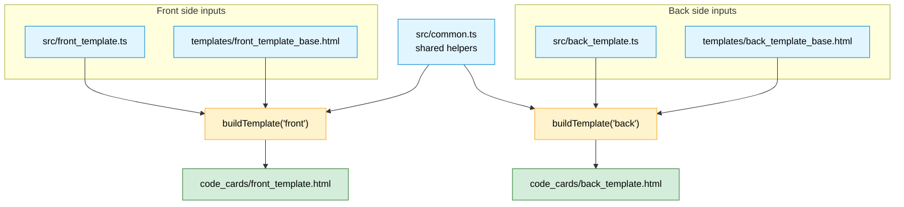
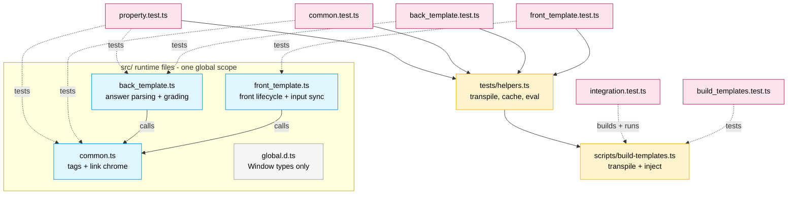

# 3 · Module & File Structure

The file layout has two independent stories, so this page keeps them as two
small diagrams instead of one crowded graph:

- **3a — Build-time composition:** which source files combine into each
  generated card.
- **3b — Code relationships:** how the `src/` files depend on each other at
  runtime, and how the tests map onto them.

## 3a · Build-time composition

`common.ts` is **shared** — it feeds both sides. Everything else is
side-specific: each card side is `common.ts` + that side's `*_template.ts` +
that side's `*_base.html`, combined by one `buildTemplate()` call. (`styling.css`
is intentionally absent — it is hand-maintained, not produced by the build.)

> The mechanics of a single `buildTemplate()` call (transpile + placeholder
> substitution) are in [`02-build-pipeline`](./02-build-pipeline.md).

## 3b · Code relationships (runtime deps + tests)

Solid arrows are **runtime calls**; dotted arrows are **test targets**. Both
card entry points call into the shared `common.ts` functions. The unit and
property tests load sources through the shared harness (`tests/helpers.ts`),
which transpiles via the build's own `transpileSource()`; the integration test
builds the full templates in-memory and exercises them end-to-end.

## How the pieces fit

- **Shared logic** (`src/common.ts`): `displayTags`, `prettifyTag`, and
  `setLinkText`, used by both card sides.
- **Front logic** (`src/front_template.ts`): captures input into `window.data`,
  focuses the field, and wires Enter/hint behavior.
- **Back logic** (`src/back_template.ts`): reads `window.data`, grades answers,
  and recolors inputs.
- **Base HTML** (`templates/*_template_base.html`): layout, Anki fields, and
  `%COMMON_JS%` / `%TEMPLATE_JS%` slots.
- **Build** (`scripts/build-templates.ts`): transpiles and injects JavaScript,
  then writes `code_cards/*.html`.
- **Output** (`code_cards/*.html`, `styling.css`): pasted into Anki; HTML is
  generated, CSS is manual.
- **Types** (`src/global.d.ts`): the `Window` contract (`data`, `pycmd`) at
  compile time only.
- **Test harness** (`tests/helpers.ts`): transpiles through the build's
  `transpileSource()`, caches the result, and evals into jsdom.
- **Tests** (`tests/*.test.ts`): unit, build-script, property-based, and
  end-to-end lifecycle suites.

## Notes

- **`common.ts` is the shared dependency.** Because everything is compiled with
  `module: none`, "depends on" simply means *its functions are defined in the
  same global scope first*. The build guarantees this by emitting `%COMMON_JS%`
  before `%TEMPLATE_JS%`.
- **Tests load the exact code that ships.** The harness transpiles the real
  `src/` files through the build's own `transpileSource()` (one home for the
  compiler settings) and `eval`s them into a jsdom `window`. See
  [`07-test-and-ci`](./07-test-and-ci.md) for the full test architecture and
  the CI gate.
- **`dist/` is unused by the build** — it only appears if you run
  `npx tsc` manually. The build never reads it.
