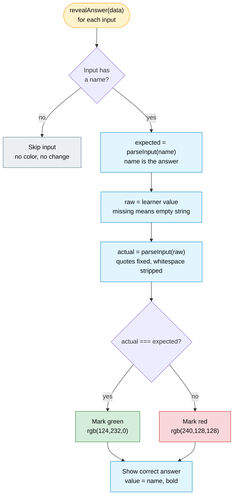

# 5 · Answer Validation

What `revealAnswer(data)` does on the Back card, for **each** `<input>`. The
comparison is deliberately lenient about whitespace and smart quotes so that
cosmetic differences never mark a correct answer wrong. Implemented in
[`src/back_template.ts`](../../src/back_template.ts).

## Normalization: `parseInput()`

Both sides of the comparison are normalized so formatting never causes a false
negative:

| Transform | Rule | Example |
|-----------|------|---------|
| Smart double quotes | `“` `”` → `"` | `“x”` → `"x"` |
| Smart single quotes | `‘` `’` → `'` | `‘y’` → `'y'` |
| Whitespace | all runs of whitespace removed (`\s+`) | `git  reset` → `gitreset` |

- **Both** the expected value (the `name` attribute) and the actual value (what
  the learner typed) go through the full `parseInput()`. The learner may type
  curly quotes (especially on mobile), and the `name` attribute may contain them
  too — e.g. pasted from a website or auto-converted by an editor — so both
  sides are normalized identically before comparison.

## Consequences of this design

- **Whitespace is never significant.** `console.log` and `console . log` grade
  identically. This is intentional — see the "gotchas" in `CLAUDE.md`.
- **The answer is always revealed.** Regardless of right/wrong, `input.value` is
  overwritten with the correct `name` and bolded, so the learner sees the
  expected answer in-place.
- **Unnamed inputs are inert.** No `name` → skipped here and never stored on the
  Front (see [`04-runtime-data-flow`](./04-runtime-data-flow.md)).
- **Missing keys are safe.** `data[name] ?? ""` means an input the learner never
  touched grades as an empty string (wrong) rather than throwing.
