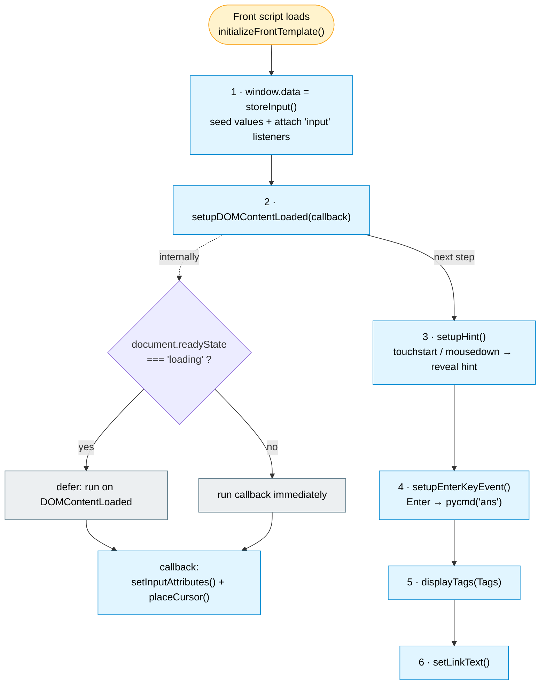
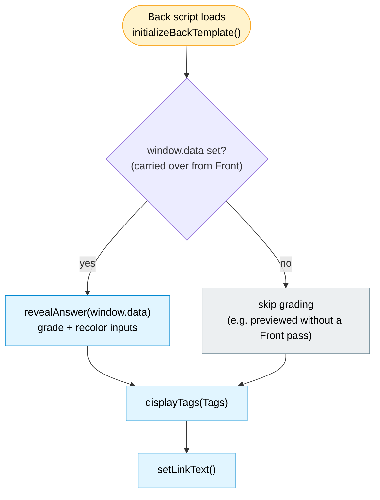

# 6 · Card Initialization Lifecycles

Each card side runs a single entry-point function immediately when its script
tag executes. These are the "what happens on load" flows.

## Front card — `initializeFrontTemplate()`

Source: [`src/front_template.ts`](../../src/front_template.ts). Steps run in this
exact order; the numbered nodes match the call order in the function body.

- **`storeInput()` runs first** so `window.data` exists before anything else.
- **`setInputAttributes()` + `placeCursor()` are deferred** behind
  `setupDOMContentLoaded` because they touch DOM elements; if the DOM is already
  parsed they run synchronously, otherwise they wait for `DOMContentLoaded`.
- `setInputAttributes()` disables autocapitalize / autocomplete / autocorrect /
  spellcheck so code typing is friction-free on mobile.

## Back card — `initializeBackTemplate()`

Source: [`src/back_template.ts`](../../src/back_template.ts). Much shorter — its
job is to grade, then render the shared chrome (tags + link).

- The **`window.data` guard** means the Back is defensive: if it somehow renders
  without a Front pass having stored data, it simply skips grading instead of
  erroring.
- `displayTags()` and `setLinkText()` run on **both** sides (they come from
  `common.ts`), which is why the tag row and link render identically front and
  back.

## Shared chrome (both sides) — from `common.ts`

| Function | Effect |
|----------|--------|
| `displayTags("{{Tags}}")` | Splits the space-delimited tag string, prettifies each (`A::B_C` → `A - B C`), sorts, and writes into `#content_tag_left` |
| `setLinkText()` | Sets the first `<a>`'s text to `"Link"` (the URL field, once populated, becomes the source link) |

## Related

- Where `window.data` comes from and how the flip works:
  [`04-runtime-data-flow`](./04-runtime-data-flow.md)
- What `revealAnswer` does internally:
  [`05-answer-validation`](./05-answer-validation.md)
