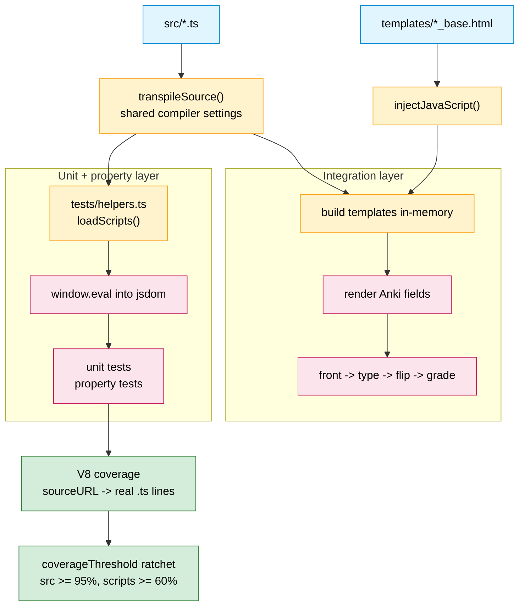
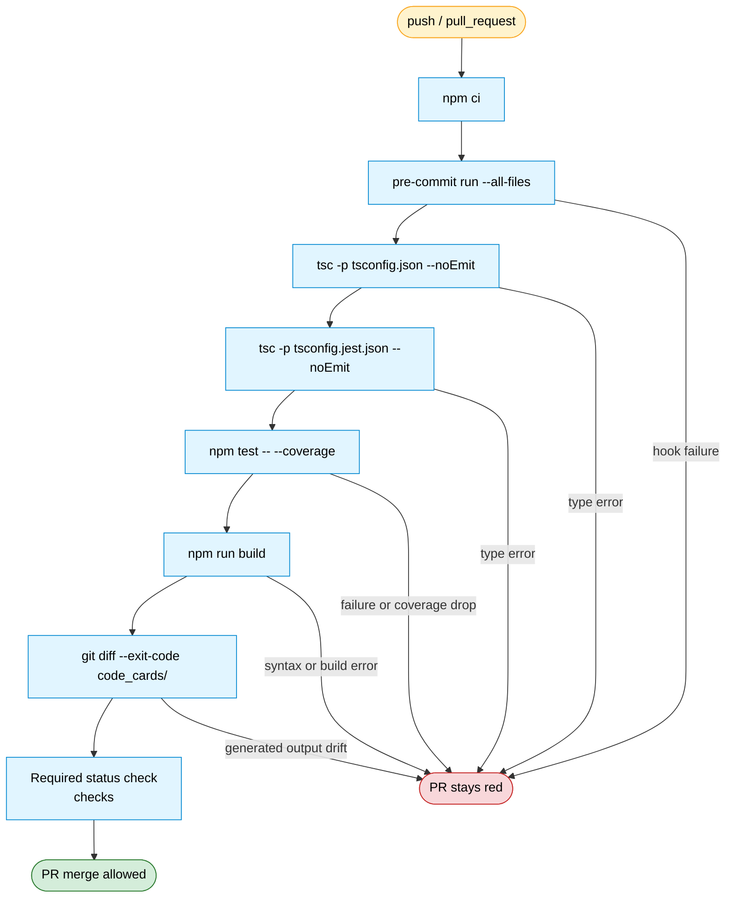

# 7 · Test Architecture & CI Gate

How the test suite exercises the exact code that ships, why coverage can see
eval'd code, and what CI refuses to merge. Implemented in
[`tests/`](../../tests), [`jest.config.js`](../../jest.config.js), and
[`.github/workflows/ci.yml`](../../.github/workflows/ci.yml).

## 7a · Test architecture — three layers, one code path

Every layer reaches the shipped code through the build script's own
`transpileSource()`, so the compiler settings cannot drift between what is
tested and what ships. The unit/property layers eval individual `src/` files;
the integration layer builds the complete templates in-memory and runs the
whole front → flip → back journey.

Two non-obvious mechanics, documented so nobody "fixes" them:

- **Coverage needs V8 + sourceURL.** Jest's default (Istanbul) provider
  instruments at the transform stage and reports 0% for everything the
  eval-based tests exercise. The harness appends `//# sourceURL=file://…` and
  an inline source map, which the V8 provider maps back to the real `.ts`
  files, line-precise.
- **Strict-eval scoping in the integration test.** The built script starts
  with `"use strict"`, so under `eval()` its function declarations stay scoped
  to the eval. That is fine: only `window.data` must cross the card flip, and
  it is assigned to `window` explicitly.

## 7b · The CI gate

Runs on every push and pull request on the Node 26 major line, the tested
baseline (`engines: ">=24"`, `.nvmrc` tracks 26 locally). The CI job is named
`checks` — deliberately version-agnostic — and is designed to be the required
PR status check, so any failed step keeps the PR red.

The pre-commit gate runs the same hooks as a local commit:

- formatting guards from `pre-commit-hooks`;
- `codespell`;
- TypeScript type-checks for both tsconfigs;
- Jest tests.

The drift gate converts "remember to regenerate `code_cards/` after editing
`src/`" into a hard failure and implicitly asserts the build is deterministic.

To block PR merges, protect `main` in GitHub and require the CI job's status
check, `checks` from the `CI` workflow. Enable "Require status checks to pass
before merging" and "Require branches to be up to date before merging" so the
green check must be current for the PR head.

The same checks run locally: `make check` (typecheck + test + build) plus
`pre-commit run --all-files`.

## Related

- Build mechanics: [`02-build-pipeline`](./02-build-pipeline.md)
- Which tests target which modules: [`03-module-structure`](./03-module-structure.md)
- The runtime behavior the integration test replays:
  [`04-runtime-data-flow`](./04-runtime-data-flow.md)
