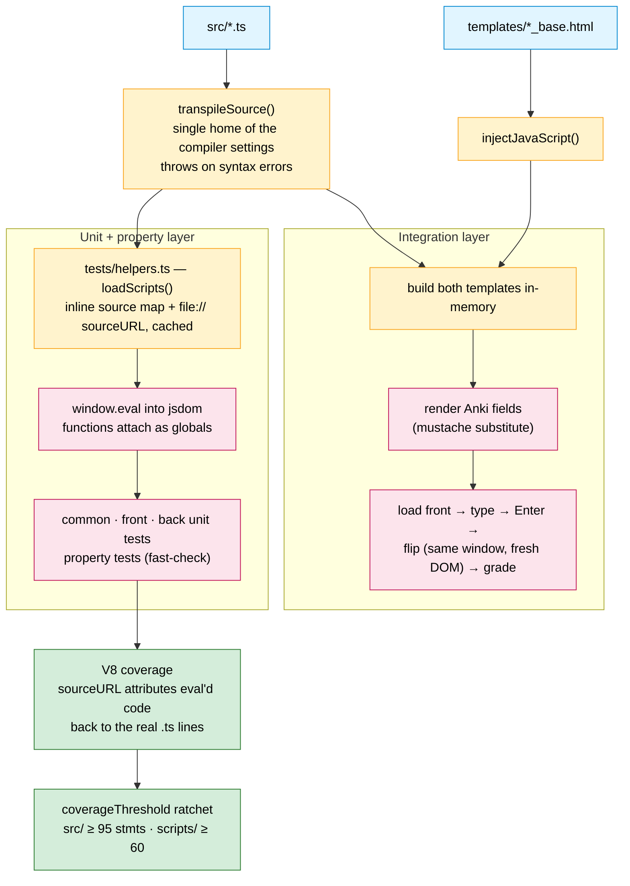
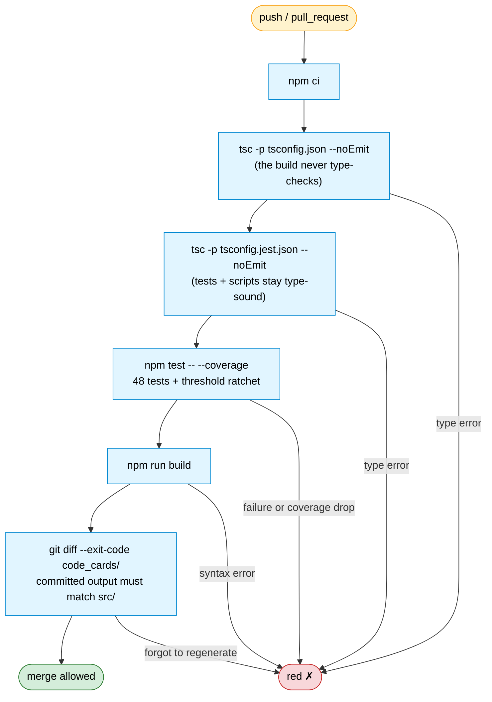

# 7 · Test Architecture & CI Gate

How the test suite exercises the exact code that ships, why coverage can see
eval'd code, and what CI refuses to merge. Implemented in
[`tests/`](../../tests), [`jest.config.js`](../../jest.config.js), and
[`.github/workflows/ci.yml`](../../.github/workflows/ci.yml).

## 7a · Test architecture — three layers, one code path

Every layer reaches the shipped code through the build script's own
`transpileSource()`, so the compiler settings cannot drift between what is
tested and what ships. The unit/property layers eval individual `src/` files;
the integration layer builds the complete templates in-memory and runs the
whole front → flip → back journey.

Two non-obvious mechanics, documented so nobody "fixes" them:

- **Coverage needs V8 + sourceURL.** Jest's default (Istanbul) provider
  instruments at the transform stage and reports 0% for everything the
  eval-based tests exercise. The harness appends `//# sourceURL=file://…` and
  an inline source map, which the V8 provider maps back to the real `.ts`
  files, line-precise.
- **Strict-eval scoping in the integration test.** The built script starts
  with `"use strict"`, so under `eval()` its function declarations stay scoped
  to the eval. That is fine: only `window.data` must cross the card flip, and
  it is assigned to `window` explicitly.

## 7b · The CI gate

Runs on every push and pull request, on Node 24 — the current LTS and the
project's single supported line (`engines: ">=24"`, `.nvmrc`). A PR cannot
merge green if any step fails.

The drift gate (last step) is the quiet hero: it converts "remember to
regenerate `code_cards/` after editing `src/`" into a hard failure and
implicitly asserts the build is deterministic.

The same checks run locally: `make check` (typecheck + test + build) and the
pre-commit hooks (`pre-commit install`) catch everything before it reaches CI.

## Related

- Build mechanics: [`02-build-pipeline`](./02-build-pipeline.md)
- Which tests target which modules: [`03-module-structure`](./03-module-structure.md)
- The runtime behaviour the integration test replays:
  [`04-runtime-data-flow`](./04-runtime-data-flow.md)
