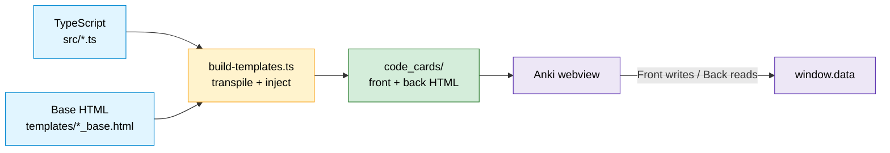

# Architecture Diagrams

Mermaid architecture diagrams for the **Code Cards for Anki** template system —
an Anki flashcard system that transpiles TypeScript into JavaScript, injects it
into HTML templates, and produces interactive code-practice cards.

Each page below focuses on one view of the system, most-important-first. All
diagrams are [Mermaid](https://mermaid.js.org/) and render natively on GitHub and
in most Markdown viewers — no build step required.

## The diagrams

1. [System Context](./01-system-context.md) - repo to build to Anki to learner.
   Type: flowchart.
2. [Build Pipeline](./02-build-pipeline.md) - how `npm run build` transpiles
   TypeScript and injects it into HTML. Type: flowchart.
3. [Module & File Structure](./03-module-structure.md) - how `src/`,
   `templates/`, `scripts/`, `tests/`, and output relate. Type: flowchart.
4. [Runtime Data Flow (Front → Back)](./04-runtime-data-flow.md) - how the card
   sides share state via `window.data`. Type: sequence.
5. [Answer Validation](./05-answer-validation.md) - how `revealAnswer()` grades
   and recolors each input. Type: flowchart.
6. [Card Initialization Lifecycles](./06-card-lifecycles.md) - what runs on load
   for the Front and Back cards. Type: flowchart.
7. [Test Architecture & CI Gate](./07-test-and-ci.md) - how tests exercise the
   shipped code, how coverage sees eval'd code, and what CI blocks. Type:
   flowchart.

## Where to start

- **New to the project?** Read them in order 1 → 7.
- **"How is it built?"** → [2 · Build Pipeline](./02-build-pipeline.md).
- **"How does grading actually work?"** → [4 · Runtime Data Flow](./04-runtime-data-flow.md)
  then [5 · Answer Validation](./05-answer-validation.md). This front-to-back
  `window.data` handoff is the core idea of the whole system: the flip rebuilds
  the DOM (inputs come back empty), so the global is the only carrier of what
  the learner typed.

## The system in one picture

Two build-time inputs (TypeScript logic + base HTML) become two runtime
artifacts (Front/Back HTML) that execute inside Anki and communicate through a
single global.



## Color legend

The flowcharts use a consistent palette:

| Color | Meaning |
|-------|---------|
| 🟦 Blue | Source / input / process |
| 🟨 Yellow | Entry point / build step |
| 🟩 Green | Generated output / correct result |
| 🟪 Purple | Anki runtime |
| 🟥 Red / pink | Wrong result / test files |
| ⬜ Gray | Branch / skipped / no-op |

## Maintaining these diagrams

These are **hand-authored docs**, not generated — update them when the
architecture changes. Relevant source of truth:

- Build logic: [`scripts/build-templates.ts`](../../scripts/build-templates.ts)
- Card logic: [`src/`](../../src) (`common.ts`, `front_template.ts`, `back_template.ts`)
- Base HTML: [`templates/`](../../templates)
- Tests & CI: [`tests/`](../../tests), [`jest.config.js`](../../jest.config.js),
  [`.github/workflows/ci.yml`](../../.github/workflows/ci.yml)
- Project overview & gotchas: [`CLAUDE.md`](../../CLAUDE.md) and [`BUILD.md`](../../BUILD.md)

To preview a single diagram while editing, paste its ` ```mermaid ` block into
the [Mermaid Live Editor](https://mermaid.live).
